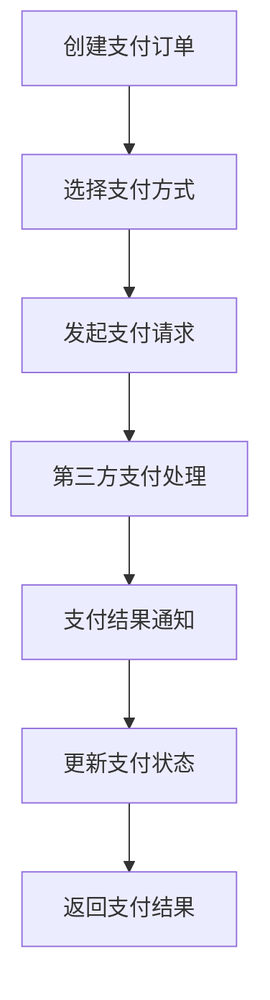
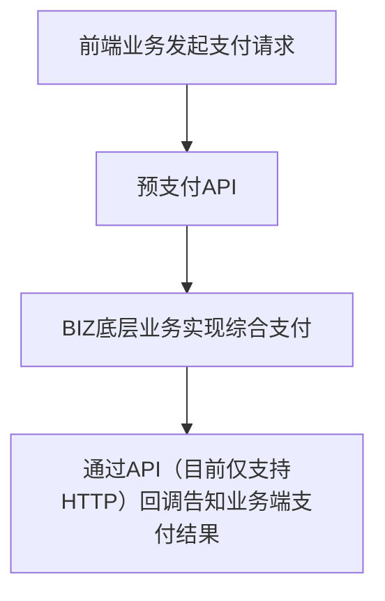

# spring-boot-starter-finance 综合支付模块

## 模块介绍

spring-boot-starter-finance 是一个支付管理相关的基础组件模块，主要包含与财务操作相关的功能。该模块旨在为应用提供综合支付管理的解决方案，包括支付、结算、对账等操作，支持多种支付方式和金融接口。

## 模块结构

该模块包含以下子模块：

- **spring-boot-starter-finance-api**: 财务管理相关的API接口
- **spring-boot-starter-finance-biz**: 财务管理相关的业务逻辑实现

## 业务描述

spring-boot-starter-finance 模块主要负责实现财务管理的业务逻辑，为应用提供财务相关的接口和数据。该模块的设计遵循分层架构理念，API层负责接口定义，Biz层负责业务逻辑实现。

### 核心功能

1. **支付管理**: 提供支付的创建、查询、退款等操作，支持多种支付方式
2. **结算管理**: 提供结算的创建、查询、执行等操作
3. **对账管理**: 提供对账的创建、执行、结果处理等操作
4. **财务报表**: 提供财务报表的生成、查询、导出等操作
5. **金融接口集成**: 集成多种金融接口，如银行接口、第三方支付接口等
6. **资金管理**: 提供资金的查询、转账、冻结等操作

## 流程图

### 综合支付流程

### 模块调用流程

## 使用说明

1. **引入依赖**: 在项目的pom.xml文件中引入spring-boot-starter-finance依赖
2. **配置模块**: 根据模块的要求进行配置（如在application.yml中添加支付接口配置）
3. **使用接口**: 通过spring-boot-starter-finance-api提供的接口使用财务管理功能
4. **初始化数据**: 可以使用模块提供的SQL脚本初始化相关数据

## 扩展建议

1. **添加新的支付方式**: 可以根据业务需求，添加新的支付方式
2. **扩展金融接口**: 可以集成更多的金融接口，如外汇、保险等
3. **增加财务分析**: 可以添加财务分析功能，提供更详细的财务数据和分析报告
4. **支持多币种**: 可以添加多币种支持，满足国际化业务的需求
5. **增加风控功能**: 可以添加风控功能，提高支付和资金操作的安全性